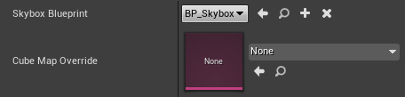
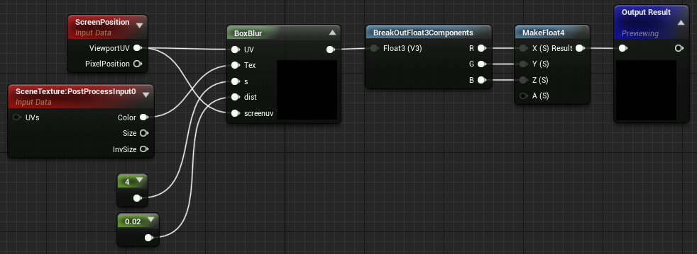

\page bkg Background Modes
The **Background Mode** dropdown selects between the major effect types. 

The default - **COLOR** - is a simple colored vignette. This has no other controls outside \ref effect "Effect Settings".

> **TIP:** All \ref mask "Mask Modes" can be used with all **Background Modes** - for example, \ref mmask "MASK" with \ref mblur "BLUR" will blur everything in the periphery except masked objects.

Note that when using the **VRTunnellingProMobile** component, both **COLOR** and **SKYBOX** modes allow the **Iris Z Rejection** feature, an optimization that saves pixel fillrate and overdraw. Before the scene is drawn, this writes to the z-buffer where the vignette is opaque. This stops pixels being written only to be obscured by the effect. This feature kicks in automatically, so long as the mobile component's **Mask Mode** is set to Off.

## Background Modes
- \subpage mskybox
- \subpage mblur

> **TIP:** The mobile version cannot use **BLUR** mode. Please see the \ref mobile "mobile manual page" for details.

    
    Left: **COLOR** mode. Right: **SKYBOX** mode.

\page mskybox SKYBOX Mode
This mode replaces the colored vignette with a skybox cage anchored to the **Scene Root** of your Character blueprint. There are two ways to create a skybox. The first is with a fully customisable blueprint. The plugin provides a basic Skybox blueprint that can be extended or modified, accessible in the plugin content under **VRTunnellingPro Content > Blueprints**.

> **TIP:** To see the plugin content, click **View Options** in the **Content Browser** and tick **Show Plugin Content**. 

> **TIP:** In the main **VRTunnellingPro** component, the plugins captures a cubemap 'snapshot' of the Skybox blueprint, so any visible meshes added to this blueprint will be included in the effect. 

The second method for creating a skybox is by populating the Cube Map Override parameter with a Texture Cube. This is a performant way to give the user a static reference frame instead of taking a cubemap snapshot of the Skybox blueprint.

## Settings

    
     SKYBOX mode settings

- **Skybox Blueprint**: The blueprint to use as a texture cube snaphot.
- **Cube Map Override**: The Texture Cube to use instead of a blueprint. Note that if populated, the Skybox blueprint will never be used.

    
    **SKYBOX** mode. A cubemap skybox is drawn in the vignette.

\page mblur BLUR Mode
This mode blurs the periphery instead of fading or replacing it. This provides less of a grounding effect, but can be perfect for players who suffer lower-than-average sim-sickness and find the other modes distracting.

> **TIP:** This mode is significantly more performance-intensive than other modes! See **Optimisation** below.

    
    **BLUR** mode.

## Settings
To modify the Blur settings, locate the MF_Blur material function supplied with the plugin. In this material function, locate the **BoxBlur** custom node. The pin denoted by **s** is the number of samples used to smoothe the blur. Higher values give a smoother blur quality but can impact performance. The **dist** input pin defines how much to blur the image by. This has no impact on performance, but high values can make the blur less smooth.

> **TIP:** To see the plugin content, click **View Options** in the **Content Browser** and tick **Show Plugin Content**.

    
     BLUR material function

## Optimisation
For a big blur that's cheaper on GPU time (but lower quality), increase the **dist** constant value and reduce the **s** constant value.

Remember that the point of tunnelling is to affect what the user is *not* looking at - as such, lower quality blur is *generally* not a problem. Low frame rate always is!

> **TIP:** This material function is used as part of the plugin's **Post Process** material, which is dynamically instanced at the start of play. This means you can create a **Scalar Parameter** to replace the constant values and use it to control the blur inputs at runtime via code or Blueprints, if required.

