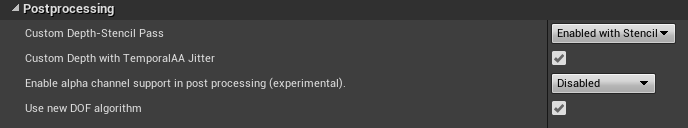
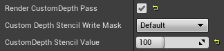
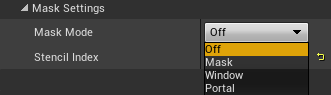

\page mask Masking
Masking allows control of where the effect appears on screen. The primary use is to exclude certain objects from the effect (see \ref mmask "MASK Mode"), but it can also be used to provide areas of the effect which appear regardless of motion. These areas can be relative to the user (see \ref mwindow "WINDOW Mode") or in world-space (see \ref mportal "PORTAL Mode").

> **TIP:** **WINDOW** mode creates the effect described in [this Oculus blog post](https://developer.oculus.com/blog/research-into-comfortable-locomotion/) under the heading *Window Into the Moving World*, while **PORTAL** mode creates the effect under the heading *Portals Into the Static World*.

> **TIP:** All **Mask Modes** can be used with all \ref bkg "Background Modes" - for example, \ref mmask "MASK" with \ref mblur "BLUR" will blur everything in the periphery except masked objects.

## Enable Masking in Unreal Engine
To use any of the masking features within an Unreal project, you must enable the stencil features in your UE4 **Project Settings**.

Open the **Project Settings** window and select the **Rendering** tab, under the **Engine** category. In the details panel, locate the **Postprocessing** tab and ensure that **Custom Depth-Stencil Pass** is set to **Enabled with Stencil**.

    
     Enabling Stencil Pass

## Mask Objects
Regardless of **Mask Mode** there are two ways to mask an actor. 

The simplest is to add a **VRTPMask** component to any actor to be masked. The actor must have a mesh component, such as a **Static Mesh Component**. Note that using this component with an actor allows its masking settings to be updated by the main plugin automatically, including its **Stencil Index**.

The alternative method is to manually select an actor then enable **Render CustomDepth Pass** within the **Rendering settings** and manually set the **Stencil Index** value that the **VRTunnellingPro** component is using in the **Mask Settings** detail panel.

    
     Manual Stencil Settings

## Modes

    
     Mask modes

> **TIP:** In the **VRTunnellingProMobile** component only, all **Mask Modes** except **OFF** will disable the **Iris Z Rejection** optimisation (see \ref bkg "Background Modes").

- \subpage mmask - Exclude individual objects from the effect.
- \subpage mwindow - Show the VR world through static windows.
- \subpage mportal - Show the effect through world-space portals.

> **TIP:** The mobile version can use **MASK**, **WINDOW** and **PORTAL** modes, but will fall back to a Post Process Material technique which may not be supported on your target devices. Please see the \ref mobile "mobile manual page" for details.

    
    Left: **MASK** mode. Right: **WINDOW** mode.

\page mmask MASK Mode
Masked objects are excluded from the effect. This is particularly useful for cockpits which already provide the user a static reference frame and therefore need not be faded out. This can help some users by making the effect less distracting, since less of the world around them changes.

    
    **MASK** mode. The cockpit object has a **VRTPMask** component attached, and excludes the vignette.

\page mwindow WINDOW Mode

    

        
         Example window mesh included with VRTP
    

Masked objects provide a "window" into the VR world regardless of motion.

> **TIP:** To use in this manner, window meshes should be parented to the **Scene Root** component so they remain static relative to the user.

This is primarily used to create windows that are static relative to the user, so the cage is seen in fixed places at all times. This can provide a constant static reference for the player regardless of motion, to reinforce the perception that the cage is the "real" world and therefore movement in the VR world is fake.

> **TIP:** This creates the effect described in [this Oculus blog post](https://developer.oculus.com/blog/research-into-comfortable-locomotion/) under the heading *Window Into the Moving World*.

This is the inverse of \ref mportal "PORTAL Mode" where masked objects show the *cage*, not the *world*.

An example window mesh, seen above, is provided in *VRTunnellingPro Content > Meshes > WindowMeshes*.

    
    **WINDOW** mode, using the provided window mesh. The cage can be seen between the "panels" of the window mesh. The vignette fades in at the periphery due to the motion settings.

\page mportal PORTAL Mode
Masked objects provide a "portal" into the cage regardless of motion. As long as \ref motion "Motion Settings" are turned on, the vignette will also fade in the cage in the user's periphery upon movement.

> **TIP:** To use in this manner, masked objects should be in world space, not affected by player motion.

This is primarily used to create portals fixed in the world, so the cage is seen "through" the world. This can help the user ignore motion by establishing the cage as a constant static background.

> **TIP:** This creates the effect described in [this Oculus blog post](https://developer.oculus.com/blog/research-into-comfortable-locomotion/) under the heading *Portals Into the Static World*.

This is the inverse of \ref mwindow "WINDOW Mode" where masked objects show the *world*, not the *cage*.

    
    **PORTAL** mode. Portal objects in the scene have the **VRTPMask** component attached. The vignette fades in at the periphery due to the motion settings.

