\page man Manual

The **VRTunnellingPro** \ref UVRTunnellingPro "[API]" component is the go-to variant for most projects. It works as a Post-Process material added to the player camera. To use, add to your player character actor.

For mobile VR - or if you just need a higher-performance option - see the \ref mobile "Mobile" page.

## Topics
- \subpage motion
- \subpage effect
- \subpage bkg
- \subpage mask
- \subpage presets
- \subpage scripting
- \subpage mobile
- \subpage debug
- \subpage techniques

\page motion Motion Settings

    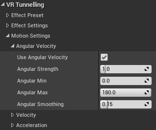
     Motion settings

All effect variants use the same motion settings. Any combination of angular velocity (turn rate), acceleration and velocity can be used and tweaked.

All motion types can be toggled and have the following properties: 
**Strength** - How much does this motion type contribute to the effect? 
**Min** - Below this motion amount, no effect. 
**Max** - Above this motion amount, the effect is maxed out. 
**Smoothing** - Motion calculation will be smoothed out over this time. This should generally be kept to a low value, e.g. less than 0.5.

### Angular Velocity
Drive the effect using turn rate. Angular velocity tends to create the most sim-sickness in users, so this is on by default. Angular velocity is measured in degrees per frame.

### Velocity
Drive the effect using speed. Constant speed generally does not contribute heavily to sim-sickness, but can do in some users and in some situations. For example, this is more of a factor in first person games with no static reference frame (e.g. a cockpit or helmet) or directional cues. Velocity is measured in Unreal units (cm) per frame.

### Acceleration
Drive the effect using acceleration. Changing speed and direction contributes to sim-sickness in many users, but less so than angular velocity.

\page effect Effect Settings

    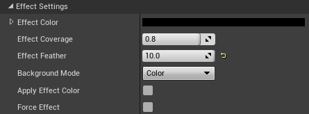
     Effect settings

**Effect Color**, **Effect Coverage** and **Effect Feather** change the basic appearance of the vignette.

Depending on \ref bkg "Background Mode", **Effect Color** controls the color of the effect.

Coverage is how much of the screen is vignetted at maximum motion.

> **TIP:** Effect Coverage of 1.0 will fill the entire viewport when the effect is at full strength. 

Effect Feather determines the fading on the inner edge of the vignette.

> **TIP:** Typically the best values for Effect Feather are between 0 and 10.

These settings apply to all modes, although how they apply may differ slightly. Please see \ref bkg "Background Modes" and \ref mask "Masking" for how individual modes use them.

\page presets Presets

    

        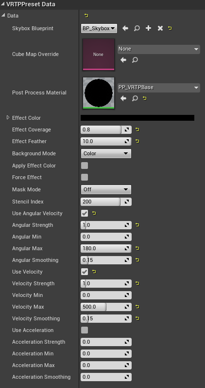
         A Tunnelling Preset
    

    

        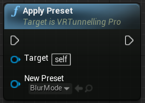
         Applying a preset in Blueprints
    

Presets offer a quick, easy, data-driven way to change settings on the fly. These assets are created in the editor and applied at run-time using the \ref UVRTunnellingPro.ApplyPreset "ApplyPreset" method, either from code or from Blueprints.

By creating a number of presets, you can give your users the ability to easily change comfort settings through an options menu. Offering these options to users (including the option to disable tunnelling) is *strongly recommended* as different users respond to different solutions.

> **TIP:** Best practice is to offer users presets, but also allow them to change individual settings if desired. This lets users quickly find the right "ballpark" with presets, then tweak details.

## Creating Presets
To create a preset, right-click in the **Content Browser** panel to bring up the Create Advanced Asset menu, then select: 
*Miscellaneous > VR Tunnelling Pro > Data Asset* 

Then from the Data Asset picker, choose between:

*VRTPPresetData* to create a preset for the *desktop* VR Tunelling component 
or 
*VRTPMPresetData* to create a preset for the *mobile* VR Tunelling component.

This creates an asset you can edit. You can then drag the preset asset into the field in the editor, or set it in code or Blueprints using \ref UVRTunnellingPro.ApplyPreset "Apply Preset".

> **TIP:** Both the desktop and the mobile components support presets, but be sure to create the correct data asset for the corresponding component type used within your project.

## Editing Presets
Settings on a **Preset** asset match all of those on the **VRTunnellingPro** component, but are all shown at once regardless of modes. This can be overwhelming but allows full, detailed control for advanced users.

> **TIP:** Toggling the Enable Preset parameter on the VRTunnelling component attached to your player will store all of the previous effect settings as a 'snapshot', so that disabling the preset returns the plugin to those previous settings.

\page scripting Scripting with Blueprints
This page contains all of the Blueprint nodes exposing the VRTP component's functions to the engine.

Almost all settings can be changed from either Blueprints or code. However the simplest way to change settings is using the \ref presets "Presets" system.

For full details, please refer to the \ref UVRTunnellingPro "API reference".

<table>
<tr><td>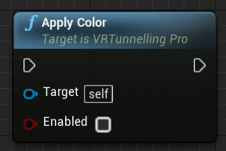</td><td>\ref UVRTunnellingPro.ApplyColor "Apply Color"</td></tr>
<tr><td>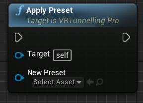</td><td>\ref UVRTunnellingPro.ApplyPreset "Apply Preset"</td></tr>
<tr><td>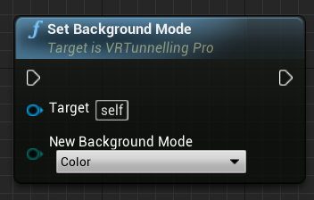</td><td>\ref UVRTunnellingPro.SetBackgroundMode "Set Background Mode"</td></tr>
<tr><td>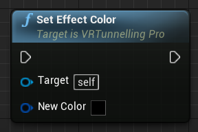</td><td>\ref UVRTunnellingPro.SetEffectColor "Set Effect Color"</td></tr>
<tr><td>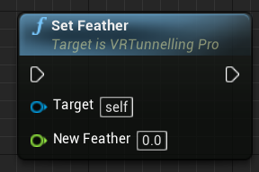</td><td>\ref UVRTunnellingPro.SetFeather "Set Feather"</td></tr>
<tr><td>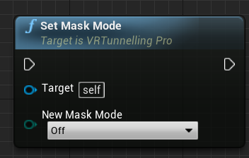</td><td>\ref UVRTunnellingPro.SetMaskMode "Set Mask Mode"</td></tr>
<tr><td>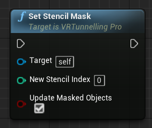</td><td>\ref UVRTunnellingPro.SetStencilMask "Set Stencil Mask"</td></tr>
</table>

\page mobile Mobile
Performance requirements for mobile VR are extremely tight, and as such fullscreen image effects are often undesirable. The **VRTunnellingProMobile** component\ref UVRTunnellingProMobile "[API]" provides the tunnelling effect at much higher performance without using post-processing. To use, add the component to your player Character blueprint.

To achieve this, basic color, skybox and mask modes are available but more advanced features such as blur are not.

> **TIP:** This effect uses the **Iris Z-Rejection** optimisation (see \ref bkg "Background Modes") automatically unless the **Mask Mode** is enabled.

## Effect Settings

    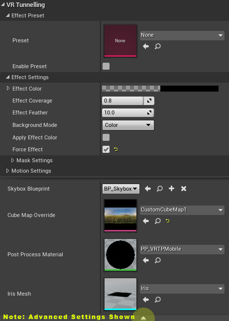
     Mobile effect settings

**Effect Color**, **Effect Coverage** and **Effect Feather** are the same as in the non-mobile effect variants - please see \ref effect "Effect Settings".

To use a skybox in the vignette, click the Show Advanced button at the bottom of the plugin details panel then drop or pick a Texture Cube for th eCube Map Override parameter.

tick **Draw Skybox** and select a cubemap for the **Effect Skybox**. Ticking **Apply Effect Color** in the **Effect Settings** will tint the skybox using **Effect Color**.

## Masking
See \subpage mmmask "Mobile Masking" page.

## Motion Settings
These settings are shared with the non-mobile effect variants - please see \ref motion "Motion Settings".

## Platform Support
This version of the effect works on all supported platforms, mobile and non-mobile. It can work very well for desktop or console projects with a tight performance budget.

**VRTunnellingProMobile** on non-mobile platforms supports single-pass stereo, as does **VRTunnellingPro**. However it does *not* support single-pass stereo on mobile platforms. These include GearVR, Cardboard and Daydream.

Furthermore, while VRTP *may* work with Vulkan on some mobile devices, this is not yet officially supported and in general may not work.

    
     Mobile tunnelling in **SKYBOX** mode.

\page mmmask Masking

    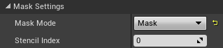
     Mobile masking settings

All Masking modes are available in the mobile component, including \ref mmask "MASK", \ref mwindow "WINDOW" and \ref mportal "PORTAL". For more information on using these mask modes, refer to the main \ref mask "Masking" page of this documentation.

> **TIP:** Masking works with or without the **CubeMap Override** parameter filled with a texture cube.

> **TIP:** Masking using any mode requires that the plugin falls back to the Post Process camera material as used by the desktop **VRTunnellingPro** component. Using masking also disables the **Iris Z-Rejection** optimisation and therefore may increase fillrate requirements. It will also increase drawcalls according to the number of objects being masked.

## Settings
Just as with the desktop **VRTunnellingPro** component, Mobile masking uses the stencil buffer. Ensure that your project and hardware support this. For more information in setting up your project to use the stencil buffer, see the section on **Enabling Stencil Masking** in the main \ref mask "Masking" page of this documentation.

    
    Mobile tunnelling with masking

\page debug Debug Options

    

        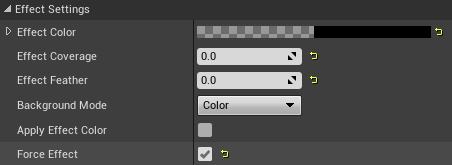
         Force Effect
    

## Force Effect
Toggling **Force Effect** and selecting a **Strength** manually controls the vignette without needing motion. This is useful to tweak effect settings.

\page techniques Techniques
Tunnelling is a powerful VR comfort tool. But great VR requires lots of experimentation and tweaking. Comfort solutions vary wildly depending on what works in a given project, what suits that project, and what suits individual users. As such, the golden rules are:

- Make sim-sickness reduction part of the core of your project, not just added on top. This might mean more than just tunnelling.
- Give your users as many project-appropriate options as possible, with solid defaults.
- Be prepared to feel sick so your users don't have to.

That said, below are various tunnelling settings that can work well for particular project types. These are best used as starting points, as a good implementation will require fine-tuning and flexibility for users. It's also best not to limit yourself to these starting points, as you may find a completely unexpected way to improve your solution.

## Vehicles
Vehicles (cars, spaceships etc) have a major benefit - the cockpit. This gives users two things. Firstly, a static reference frame to ground them. Secondly, a clear indication of direction of motion. Users know that when they press "forward", they will move in the direction the vehicle points.

- **Scene Root** should link to the vehicle itself.
- **Motion Settings**: At minimum, use **Angular Velocity**. Smooth, slow vehicle acceleration generally causes *more* sim-sickness than fast, abrupt acceleration; in this case using **Acceleration** may well help. In all cases, allowing users to turn on **Acceleration** and **Velocity** modes is recommended.
- **Background**: For many users, **COLOR** will be sufficient in vehicles. However **SKYBOX** mode is a good default to provide a strong grounding effect.
- **Masking**: Using **MASK** mode and masking the cockpit is generally effective. This increases grounding by retaining more static objects while decreasing distraction by reducing visual change when the effect is active.

## First Person - Thumbstick Movement
First person games using thumbsticks/WASD to move are very challenging in terms of sim-sickness. Generally there is no static reference frame, and directional ambiguity. The two major causes of sim-sickness in this case is rotation and not knowing the direction of movement.

Consider adding a clear visual indicator of the player's forward direction. For example, the green arrow in the *Example* maps (although this is overly intrusive!). Specific implementation will depend on how direction is determined - for instance, do you use HMD direction, player object rotation, an average of both or something else?

- **Scene Root** should be the player object.
- **Motion Settings**: Generally **Angular Velocity** and **Acceleration** should be used at minimum. Allow users to turn on **Velocity** mode as well if desired.
- **Background**: Usually **SKYBOX** is a good default as **COLOR** may be insufficient for some players. Consider allowing **COLOR** and/or **BLUR** mode for players with higher sim-sickness tolerance.
- **Masking**: It can be useful to use **MASK** mode to mask objects attached to the player - for instance body and guns. Direction indicators should generally be masked. Some players will find that **WINDOW** mode provides a stronger grounding by adding the constant static reference that first person games usually lack - however this is usually too intrusive to be default. **PORTAL** mode can also be a useful option if portals are placed intelligently in the world.

## First Person - Wand-Directed Movement
Wand-directed movement is when the player moves in the direction they are pointing. In this case direction can be clearer, and generally there is no artificial rotation. Most of the guidelines for thumbstick motion apply, but there are some other considerations.

- **Motion Settings**: **Acceleration** is the most important mode here, but consider using **Velocity** for maximum effect.
- **Background**: While usually less intense than thumbstick, **SKYBOX** is still a good default for most players.
- **Masking**: See **Thumbstick Movement**. Masking the pointer object can be very important to maximise directional information.

## First Person - Physical Movement
This includes techniques such as running on the spot, arm-swinging and grab-and-pull locomotion. In these cases, direction is generally clear and physical motion can help many players. Most of the guidelines for wand-directed motion apply, but there are some other considerations.

- **Motion Settings**: See **Wand-Directed Movement**. Consider using **Velocity** by default as well, as for some techniques - especially grab-and-pull - motion happens in sharp bursts and this will help the effect respond well.
- **Background**: See **Wand-Directed Movement**. **BLUR** can again work well for less sensitive players, and can feel "right" with the kinds of motion involved.
- **Masking**: See **Wand-Directed Movement**. This depends heavily on project. For example, masking hands in arm-swinging and grab-and-pull can be effective, but a stronger grounding can be achieved with **WINDOW** mode. Consider using **WINDOW** mode with the provided *Window* mesh, and disabling the effect entirely when not moving. This can be particularly effective with grab-and-pull, making it very clear that the *world* is moving, not the player.

## Comfort Calibration
Where possible, we recommend implementing a dedicated "Comfort Calibration" mode in your project, so users can easily dial in their preferred settings for VRTP and/or other comfort solutions.

This should be a simple level where users can use the locomotion system while easily switching between comfort presets in-game, without returning to the menu. This allows quick comparison of settings and their effects.

It should be as easy as possible to toggle between presets. For example, remapping the primary/secondary fire buttons to next/previous preset, or placing physical buttons in-world to select presets.