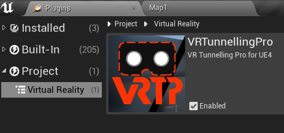
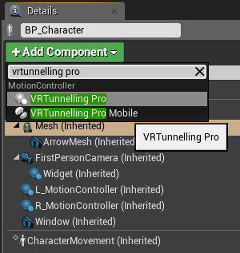

\page quickstart Quickstart Guide
## Enable the Plugin
First, ensure that the plugin is installed by either dropping the VRTunnellingPro plugin folder into your project's Plugins folder, or add it as an engine plugin to your Unreal Engine 4.22 Plugins folder.

Ensure that the plugin is enabled within the editor by accessing the Edit menu and opening the Plugins browser. Locate the plugin within the Virtual Reality category and ensure that the Enabled box is ticked for the plugin.

    
     VRTunnellingPro plugin enabled

## Using the Tunnelling Component
Select your player Character blueprint and within either the scene or the Blueprint editor, use the Add Component button then select the VRTunnellingPro component. Note that the Character blueprint must have a camera attached to it, in order for the plugin to function.

    
     Adding VRTunnellingPro component

## Example Level
The *Map1* level is a quick and easy way to test out the main features of VRTP. You can quickly cycle between basic, skybox and masked modes while moving around, and see how these line up with settings on the **VRTunnellingPro** component.

- Turn with the mouse or a gamepad controller
- Move with **[WASD]** or gamepad thumbstick
- Cycle example presets with **[1-8]** or use Left Mouse Button / Left CTRL key
- Force the effect vignette to full using the Right Mouse Button / Right CTRL key

The *Map2_Mobile* level is an equivalent version of the same level, but set up with the **VRTunnellingProMobile** component. Note that no mobile device-specific controls have been set up for this example, so mobile builds compiled directly from it will not have built-in player controls by default.

## Motion Settings

    

        
         Motion settings 
    

    

        
         Browse skybox blueprint 
    

The default settings on the **Tunnelling** effect use the turning rate (angular velocity) of the **Motion Target** to drive a black vignette in the user's peripheral vision.

To also use acceleration and/or speed to drive the effect, tick **Acceleration** and/or **Velocity**. These motion modules have no effect by default - set the **Min** and **Max** values on each according to the motion present in your project.

Below the **Min** value of each, no effect will appear. Above the **Max** value, the effect will max out.

The **Smoothing** value smoothes out the motion calculation to prevent the effect flashing and stuttering.

## Effect Settings
Set the color, coverage and feather to change the appearance of the basic vignette. Coverage is how much of the screen is vignetted at maximum motion, and feather determines the fading on the inner edge.

To use a skybox for the vignette, change the **Background Mode** to **SKYBOX**. Click the Advanced dropdown at the bottom of the plugin details panel.
From here you can do one of the following:
- Browse to the supplied Skybox blueprint, where you can change the static mesh or material
- Use your own custom blueprint (it is recommended to do this by extending the one supplied)
- Drop a Texture Cube directly into the Cube Map Override parameter. This will force the plugin to use the texture cube instead of a blueprint, which can improve performance

    
    Left: **COLOR** mode. Right: **SKYBOX** mode.

## Advanced Modes
For in-depth information, please refer to the \ref man "Manual" and \ref Sigtrap.VrTunnellingPro "API reference".